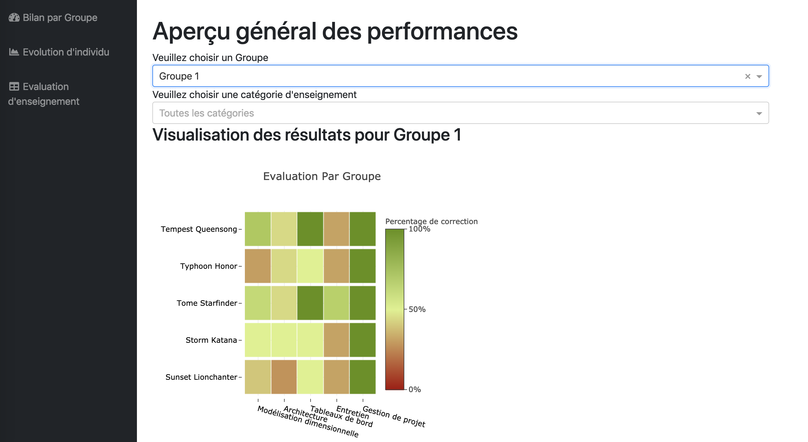

# Business Intelligence Projet DASH


## Getting Started

**todo**

### Prerequisites


```
Python3

Linux
```

### Installing

```
$ git clone https://github.com/lhaippp/Dash_Student_Management_System

$ cd Dash_Student_Management_System

$ chmod +x set-environment.sh

$ source set-environment.sh
```
If success, you'll see a result like below:
```
****************************************************************
Congratulations! All the environment are installed successfully
****************************************************************
Now you can view and edit the project!
****************************************************************
```

### Running the Dashboard

```
$ python3 app.py
```
```
... Running on http://127.0.0.1:8055/ (Press CTRL+C to quit)
```
Now you can visit the dashboard at [http://127.0.0.1:8055/](http://127.0.0.1:8055/)

### Demo
Here we offer a demo for the [dashboard](BI-projet/docs/Dash.png)



## Built With

* [Dash](https://dash.plot.ly/) - The productive Python framework for building web applications
* [Pandas](https://pandas.pydata.org/pandas-docs/stable/reference/api/pandas.DataFrame.html) - The high-performance, easy-to-use data structures and data analysis tools
* [Jupyter](https://jupyter.org/) - The services for interactive computing
* [Colaboratory](https://colab.research.google.com/notebooks/welcome.ipynb?hl=zh-cn) - The free Jupyter notebook environment that requires no setup and runs entirely in the cloud.


## Versioning

We use [Github](https://github.com/lhaippp/Dash_Student_Management_System) for versioning. For the versions available, see the [tags on this repository](https://github.com/lhaippp/Dash_Student_Management_System). 

## Authors

* **Xiaorui HUO** - *ETL work* 
* **Xuanqi HUANG** - *ETL work* 
* **Hassen NJAH** - *Dash work* 
* **Haipeng LI** - *Dash work* 
* **Minh Duc NGUYEN** - *ETL work* 


## License

This project is licensed under the European Union Public License 1.1 - see the LICENSE file for details
